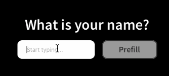

# Reactful Controlled Inputs

Yet another package for input components in Framer X, but this time they behave like traditional [React Controlled Components](https://reactjs.org/docs/forms.html#controlled-components).


## Usage

_Important: You have to do this for these inputs to work!_

Override the inputs `value` and `onValueChange` props so you are controlling the input's state with a value stored in a `Data` object.

```Typescript
const data = Data({ text: "" });

export const controlText: Override = foo => {
  return {
    value: data.text,
    onValueChange: (value: string) => {
      console.log(value);
      data.text = value;
    }
  };
};

```

This will allow you to easily change the value of the input at runtime by changing the value in the the `Data` object.

```Typescript
export const prefillText: Override = () => {
  return {
    onTap: () => {
      data.text = "John Doe";
    }
  };
};
```

### Result



## Props

### Primary

| Name            | Type                      | Description                     |
| --------------- | ------------------------- | ------------------------------- |
| `value`         | `string`                  | The current value of the input. |
| `onValueChange` | `(value: string) => void` | Event for input value changing. |

### Other Attributes

#### All Input Types

- `placeholder`
- `disbaled`
- `readOnly`

#### Number Input Only

- `numberMin`
- `numberMax`
- `numberStep`

#### Select Input Only

- `selectOptions`

### Other Events

- `onBlur`
- `onFocus`
- `onMouseEnter`
- `onMouseLeave`

## Example Project

You can download an example project showing how to use this component [here](https://github.com/ourveryown/framer-x-controlled-inputs/blob/master/ControlledInputs.framerx).

## Github

If you'd like to view the source code or contribute to this package you can do so on [Github](https://github.com/ourveryown/framer-x-controlled-inputs).
